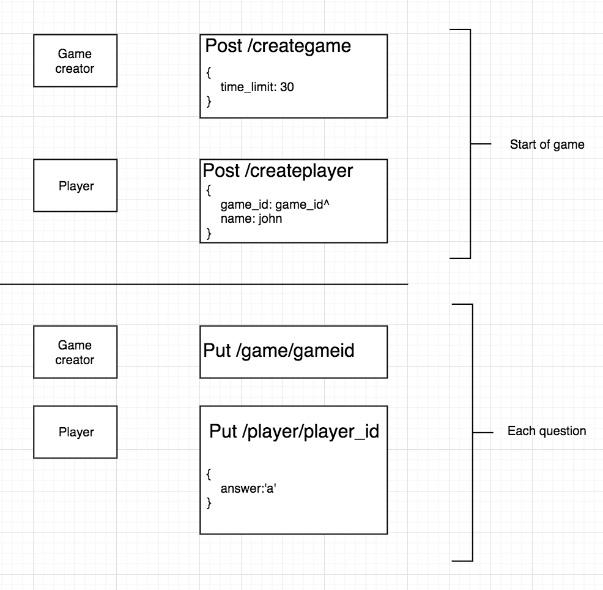

# HackHoot Backend

## Basic overview

The backend to a simple server version of Kahoot. Everything is timer based, such that the timers for each player is synchronized. Current features include creating and getting questions for games, creating games which get 10 random questions from the created questions, and players that can join and answer questions.

## Instructions

1. Get mongodb and run it with `mongod` on port 27017
2. `pip3 install -r requirements.txt`
3. run `python3 app.py`

## Game Flow



## Documentation

Look at PostMan requests for examples

Link: localhost:5000/

[Player](#Player)  
[Game](#Game)  
[Question](#Question)

### Player

**GET /player/<playerId>**

Get player

```
RETURNS:

"_id"                       : Array with \$oid key with Player ID
"name"                      : String
"game_id"                   : Game ID
"points"                    : Points that player has

```

**POST /createplayer/**

Create player in game

```

PARAMS:
"game_id"                   : String # required, returned from creategame
"name"                      : String # required

RETURNS:
"_id"                       : Array with \$oid key with Player ID
"name"                      : String
"game_id"                   : Game ID
"points"                    : Points that player has, default 0

```

**PUT /player/<playerId>**

Answer a question from player

```
PARAMS:
"answer":                   : Answer from player, A B C or D

RETURNS:
"is_correct"                : false
"points"                    : Points that player has
"game_state"                : Game status, waiting, in play, done
"cur_question_end_time"     : Array with $date key with value datetime
"next_question_start_time"  : Array with $date key with value datetime
"next_question_end_time"    : Array with \$date key with value datetime
```

**DELETE /player/<playerId>**

Deletes player

```
RETURNS:
"message"                   : deleted or error
```

### Game

**GET /game/<gameId>**

Get a game

```
RESPONSE:
"_id"                       : Array with $oid key with Game ID
"time_limit"                : Number
"game_state"                : Game status, waiting, in play, done
"questions"                 : Questions array
"players"                   : Players array
"cur_question"              : Current question, default is -1
"cur_time"                  : Array with $date key with value datetime
"cur_question_end_time"     : Array with $date key with value datetime
"next_question_start_time"  : Array with $date key with value datetime
"next_question_end_time"    : Array with \$date key with value datetime

```

**POST /creategame/**

Create a game

```

PARAMS:
"time_limit" : Number required, time limit for each question

RETURNS:
"_id"                       : Array with $oid key with Game ID
"time_limit"                : Number
"game_state"                : Game status, waiting, in play, done
"questions"                 : Questions array
"players"                   : Players array
"cur_question"              : Current question, default is -1
"cur_time"                  : Array with $date key with value datetime
"cur_question_end_time"     : Array with $date key with value datetime
"next_question_start_time"  : Array with $date key with value datetime
"next_question_end_time"    : Array with \$date key with value datetime

```

**PUT /game/<gameId>**

Update game status(start game, next question, end)

```

RETURNS:
"\_id"                      : Array with $oid key with Game ID
"time_limit"                : Number
"game_state"                : Game status, waiting, in play, done
"questions"                 : Questions array
"players"                   : Players array
"cur_question"              : Current question, default is -1
"cur_time"                  : Array with $date key with value datetime
"cur_question_end_time"     : Array with $date key with value datetime
"next_question_start_time"  : Array with $date key with value datetime
"next_question_end_time"    : Array with \$date key with value datetime

```

**DELETE /game/<gameId>**

Delete game with specific Id

```
RETURNS:
"message"                   : deleted or error
```

### Question

**POST /createquestions/**

Create question

```
PARAMS:
"question"                  : Question text
"A"                         : Answer choice A
"B"                         : Answer choice B
"C"                         : Answer choice C
"D"                         : Answer choice D
"answer"                    : Correct answer, a,b,c,d

RETURNS:
"\_id"                      : Array with \$oid key with Player ID
"A"                         : Answer choice A
"B"                         : Answer choice B
"C"                         : Answer choice C
"D"                         : Answer choice D
"answer"                    : Correct answer, a,b,c,d
```

**POST /questions/**

Create multiple questions

```
PARAMS:
"questions"                 : A list of json serialized questions, format in /createquestions/

RETURNS:
"questions"                 : The list of questions back
```

**DELETE /questions/**

Delete question

```
RETURNS:
"status"                    : deleted or error
```
